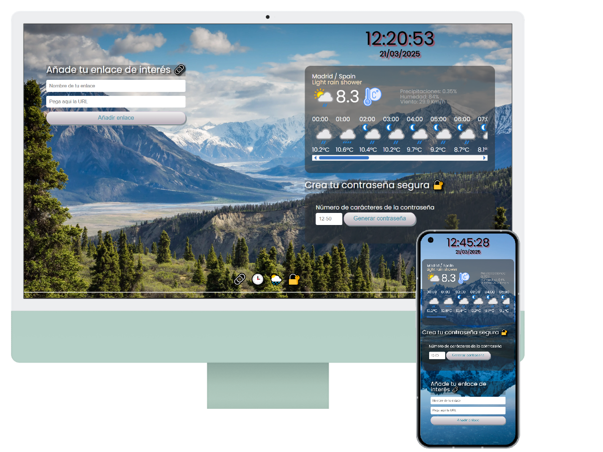

<div align="center">

# Dashboard

Este proyecto es un **Dashboard interactivo** que integra varias funcionalidades útiles y atractivas. Cada componente del dashboard está diseñado para operar de manera independiente, permitiendo una experiencia fluida y dinámica.




[](https://developer.mozilla.org/en-US/docs/Web/HTML) [](https://developer.mozilla.org/en-US/docs/Web/CSS) []

</div>


### ✨ **Funcionalidades principales**

- **🕒 Reloj digital 24h + Fecha:** Muestra la hora y fecha actual, actualizándose en tiempo real con mensajes personalizados según la franja horaria.
- **🌦️ Estación meteorológica:** Consulta el clima actual y la previsión horaria utilizando la API de WeatherAPI.
- **🔐 Generador de contraseñas seguras:** Crea contraseñas aleatorias con la opcion personalizable de longitud.
- **📌 Listado de enlaces favoritos:** Permite añadir, guardar y eliminar enlaces en el almacenamiento local del navegador.
- **🖼️ Imágenes de fondo aleatorias:** Cambia automáticamente la imagen de fondo cada 15 segundos para una experiencia visual dinámica.

## 🛠️ **Tecnologías utilizadas**

- **📄 HTML, 🎨 CSS y ⚡ JavaScript** para la estructura, estilos y funcionalidades interactivas.
- **🌍 API de WeatherAPI** para la consulta de datos meteorológicos en tiempo real.
- **💾 LocalStorage** para la persistencia de datos en el listado de enlaces.
- **⏳ setInterval() y 🔢 Math.random()** para la actualización de elementos dinámicos como el reloj y el fondo.

## 📂 **Estructura del proyecto**

```bash
📂 dashboard
 ├── 📂 assets
 │   ├── 📂 img (Imágenes utilizadas)
 │   ├── 📂 css (Estilos CSS para cada módulo)
 │   ├── 📂 js (Scripts JavaScript para cada funcionalidad)
 ├── index.html (Página principal del dashboard)
 ├── clock.html (Reloj digital + Fecha)
 ├── weather.html (Estación meteorológica)
 ├── password.html (Generador de contraseñas)
 ├── links.html (Gestor de enlaces)
 ├── footer.html
 └── README.md
```

## 🚀 **Cómo utilizar**

1. Clona este repositorio:
   ```sh
   git clone https://github.com/s0raya/project-break-dashboard.git
   ```
2. Abre `index.html` en tu navegador para acceder al **Dashboard**.
3. Explora las diferentes funcionalidades disponibles.

## 🌍 **Demo en vivo**

Puedes ver el proyecto en acción en [**GitHub Pages**](https://s0raya.github.io/project-break-dashboard/).

## 🚀 **Mejoras futuras**

- 🌦️ Añadir un selector de ciudad en la estación meteorológica.
- 🔐 Posibilidad de **personalizar más aspectos** del generador de contraseñas.
- 🎨 Mejora en la **interfaz de usuario** con animaciones y transiciones.

---

Este proyecto es un excelente ejercicio de **manipulación del DOM**, **consumo de APIs** y **gestión de eventos en JavaScript**. ¡Espero que lo disfrutes! 🚀